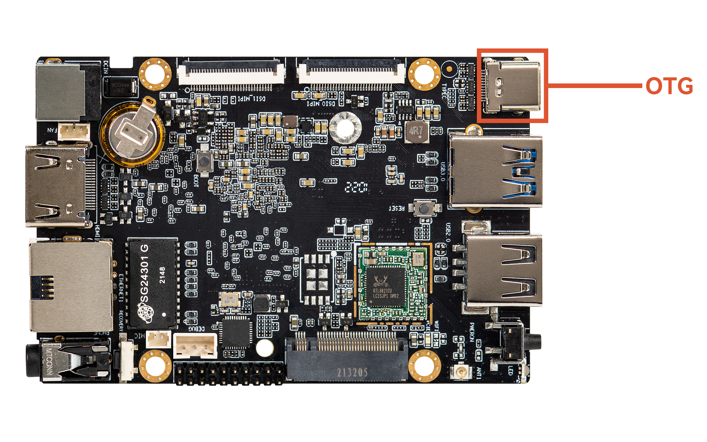
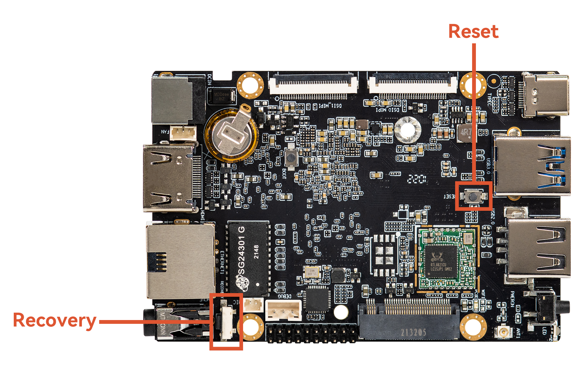

<h1>
  <p> 
    Firefly_ROC-RK3588S-PC
    <a href="https://en.t-firefly.com/product/industry/rocrk3588spc">
      
    </a>
  </p>
</h1>

<details open>
  <summary>
    <h2>
      <p>
        1. Prerequisites
        <a href="https://en.t-firefly.com/doc/download/page/id/142.html">
          
        </a>
      </p>
    </h2>
  </summary>   
  
* ### Linux_Upgrade_Tool [[Install](https://drive.google.com/file/d/1fmr4rrRqNoRvR84X7X9yNhebFQ9E1OKP/view)]

    Building Linux_Upgrade_Tool:

    ```
    #If dowbloaded from original google drive
    unzip Linux_Upgrade_Tool_xxxx.zip  
    cd Linux_UpgradeTool_xxxx  
    
    #If downloaded from this repository
    tar -xvf Linux_Upgrade_Tool_v1.65.tar.gz  
    
    cd Linux_Upgrade_Tool_v1.65  
    sudo mv upgrade_tool /usr/local/bin  
    sudo mv config.ini /usr/local/bin  
    sudo chown root:root /usr/local/bin/upgrade_tool  
    sudo chmod a+x /usr/local/bin/upgrade_tool  
    ```

* ### Linnux_adb_fastboot [[Install](https://drive.google.com/drive/folders/1nDeTIlTn4mnIVS6vl9zn57ZurxibDsOI)]

    Building Linux_adb_fastboot:

    ```
    #If downloaded from this repository
    tar -xvf adb.tar.gz
    tar -xvf fastboot.tar.gz
    
    sudo mv adb /usr/local/bin
    sudo chown root:root /usr/local/bin/adb
    sudo chmod a+x /usr/local/bin/adb
    sudo mv fastboot /usr/local/bin
    sudo chown root:root /usr/local/bin/fastboot
    sudo chmod a+x /usr/local/bin/fastboot
    ```
 
* ### A single unified firmware [[Install](https://drive.google.com/drive/folders/1B0SZpSm4JNQHP2Z92QluePQ7x7gfQ1Xz)]  

</details>  

<details open>
    <summary>
      <h2>
        <p> 
          2. Installing Ubuntu
          <a href="https://drive.google.com/drive/folders/1B0SZpSm4JNQHP2Z92QluePQ7x7gfQ1Xz">
            
          </a>
        </p>
      </h2>
    </summary>  

  * ### Enter Upgrade mode.  

    Connect the device and press the RECOVERY button to enter the Loader mode. The steps are as follows:

    * Disconnect the power adapter first  

    * Type-C data cable connects one end to the host and the other end to the development board

    

    * Press the **RECOVERY** button on the device and hold.

    

    * Connect to the power supply.  
      
    * About two seconds later, release the **RECOVERY** button.

  * ### Check the Loader mode.  

    After running upgrade_tool, you can see a Loader prompt in the connected device:

    ```
    sudo upgrade_tool

    #Positive Output:
    List of rockusb connected
    DevNo=1 Vid=0x2207,Pid=0x330c,LocationID=106    Loader
    Found 1 rockusb,Select input DevNo,Rescan press <R>,Quit press <Q>:q

    #Negative Output:
    List of rockusb connected
    No found rockusb,Rescan press <R>,Quit press <Q>:
    ```

  * ### Install Ubuntu 20.04

    Install one of the Ubuntu images from [here](https://drive.google.com/drive/folders/1B0SZpSm4JNQHP2Z92QluePQ7x7gfQ1Xz).

    Then extract downloaded archive:

    ```
    #Download package for extract *.7z archive
    sudo apt install p7zip-full

    7z x ROC-RK3588S-PC_Ubuntu20.04-Gnome-r2202_v1.0.4b_221118.7z
    cd ROC-RK3588S-PC_Ubuntu20.04-Gnome-r2202_v1.0.4b_221118
    sudo upgrade_tool uf ROC-RK3588S-PC_Ubuntu20.04-Gnome-r2202_v1.0.4b_221118.img

    #Output:
    Program Data in /usr/local/bin
    Loading firmware...
    Support Type:RK3588	FW Ver:1.0.00	FW Time:2022-11-18 09:46:36
    Loader ver:1.0b	Loader Time:2022-11-18 09:45:42
    Upgrade firmware ok.
    ```

    After that Ubuntu was installed on your Firefly_ROC-RK3588S-PC

    

</details>