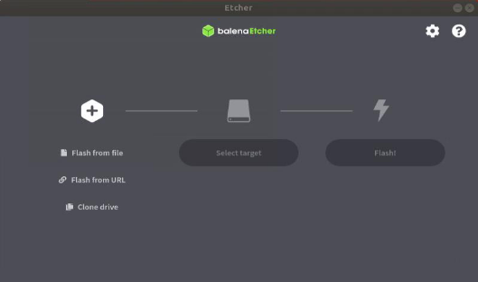
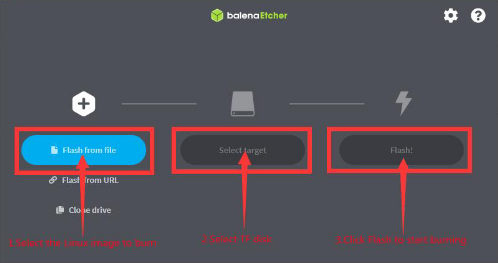
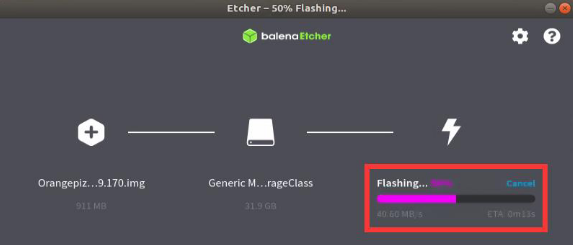
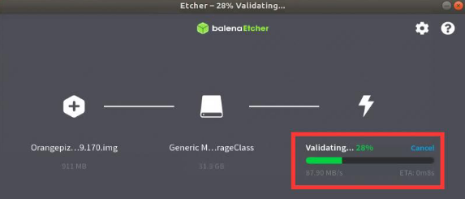
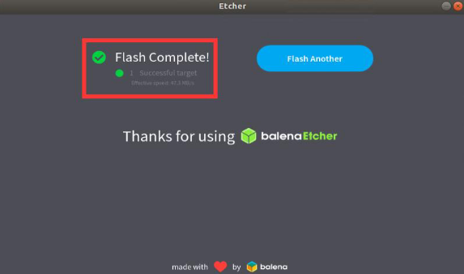
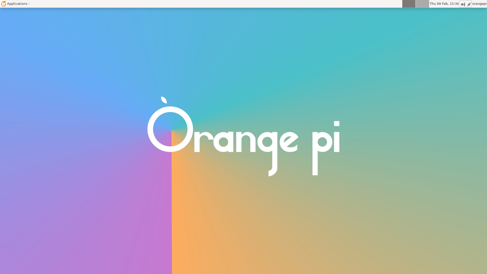

<h1>
  <p> 
    Orange Pi 5
    <a href="http://www.orangepi.org/html/hardWare/computerAndMicrocontrollers/details/Orange-Pi-5.html">
      
    </a>
  </p>
</h1>

<details open>
  <summary>
    <h2>
      <p>
        1. Prerequisites
        <a href="https://en.t-firefly.com/doc/download/page/id/142.html">
          
        </a>
      </p>
    </h2>
  </summary>   
  
* ### TF card
* ### Ubuntu image
* ### Balena etcher

</details>  

<details open>
    <summary>
      <h2>
        <p> 
          2. Installing Ubuntu
          <a href="https://drive.google.com/drive/folders/1i5zQOg1GIA4_VNGikFl2nPM0Y2MBw2M0">
            
          </a>
        </p>
      </h2>
    </summary>  

  * ### Install Balena Etcher

    You can download installer from [here](https://www.balena.io/etcher) or run in Linux terminal:

    ```
    sudo apt-get install balena-etcher
    ```

  * ### Install Ubuntu image [[Install]](https://drive.google.com/drive/folders/1i5zQOg1GIA4_VNGikFl2nPM0Y2MBw2M0)

    Tested **Orangepi5_1.1.0_ubuntu_focal_desktop_xfce_linux5.10.110.7z**.

  * ### Burn Ubuntu image to TF card

    Extract downloaded archive with Ubuntu image:

    ```
    #Download package for extract *.7z archive
    sudo apt install p7zip-full

    7z x Orangepi5_1.1.0_ubuntu_focal_desktop_xfce_linux5.10.110.7z
    ```

    Then run **Balena Etcher**.

    
    
    First select the path of the Linux image file to be burned.

    Then select the drive letter of the TF card.

    Finally, click Flash to start burning the Linux image to the TF card.

    

    The interface displayed during the process of burning the Linux image by balenaEtcher is shown in the figure below, and the progress bar displays purple, indicating that the Linux image is being burned into the TF card.

    

    After burning the Linux image, balenaEtcher will also verify the image burned into the TF card by default to ensure that there is no problem in the burning process. As shown in the figure below, a green progress bar indicates that the image has been burnt, and balenaEtcher is verifying the burnt image.

    

    The display interface of Balenaetcher after the successful record is completed. If the green indicator icon is displayed in the figure below, the mirror burning is successful, then you can exit Balenaetcher.

    

  * ### Plug TF card to OrangePi

    After successful record you can unplug the TF card into the TF card slot in the development board and Ubuntu will be installed on your Orange Pi.

    

</details>